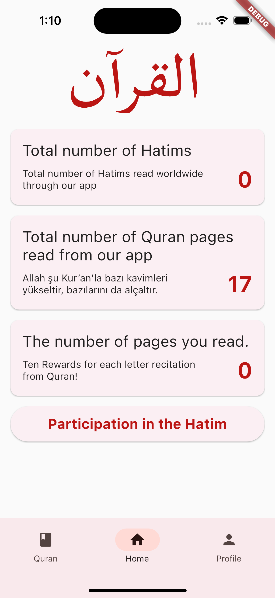
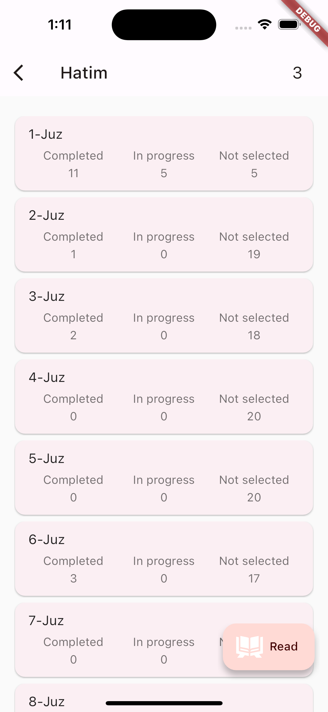
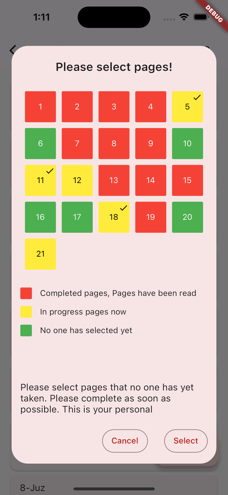
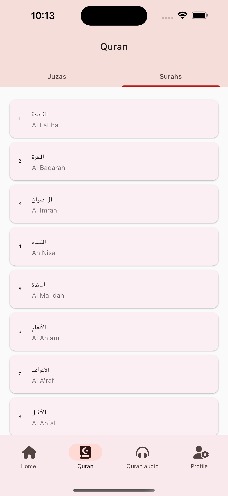
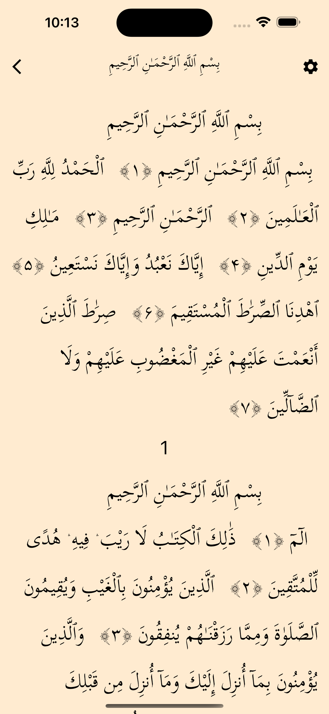
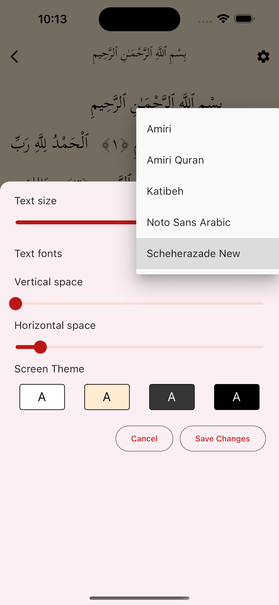
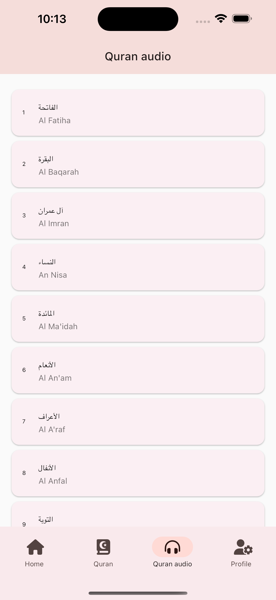
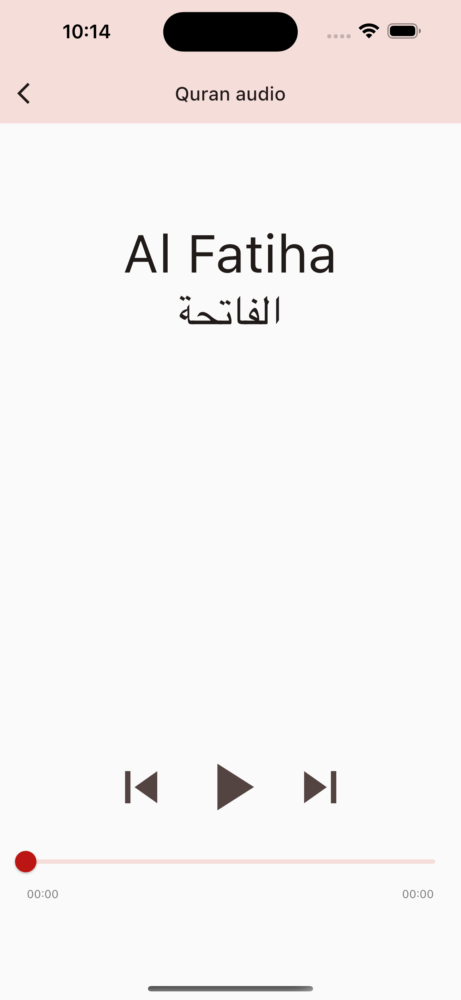
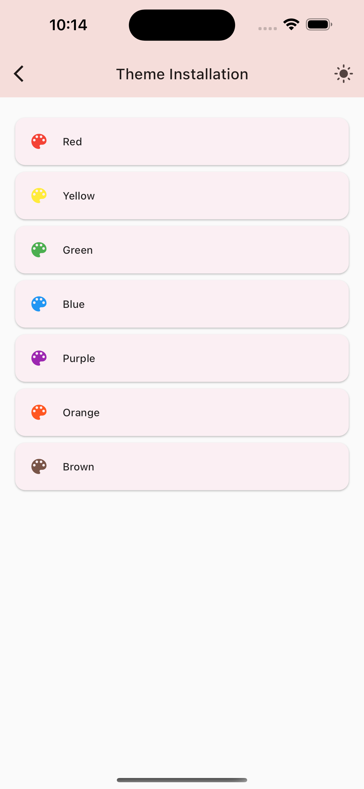

# hatim

My Quran Hatim Aplication.

<p align="center">
  
  
  
  
</p>

<p align="center">
  
  
  
  
</p>

<p align="center">
  
  
  
  
</p>

### Getting Started

## Requirements
- Dart sdk: ">=3.0.1 <4.0.0"
- Flutter: "3.10.6"
- Android: minSdkVersion 17
- iOS: --ios-language swift, Xcode version >= 14.0.0

## Melos
[Melos](https://melos.invertase.dev/) splitting up large code bases into separate independently versioned packages is extremely useful for code sharing. However, making changes across many repositories is messy and difficult to track, and testing across repositories gets complicated really fast.
To solve these (and many other) problems, some projects will organize their code bases into multi-package repositories (sometimes called [monorepos](https://en.wikipedia.org/wiki/Monorepo)).

* Install melos
```shell
dart pub global activate melos
```
Setup
```shell
melos bootstrap
```

## Run App
* If you have an AVD or real device attached, you can do
```shell
melos run-app
```

## Run tests
* run all tests from the command line:
```shell
melos test
```

## Integration tests
* run integration tests in `test_driver` directory:
```shell
melos integration-test-app
```

## Fmt
`dartfmt` lacks config file support, which implies that customizations need to be done by users individually. The default 
limit of 80 characters line length conflicts with the deeply nested structure of flutter's declarative code for designing 
widgets. This causes many unwanted linebreaks that reduce the readability of flutter code. Hence, we increase the line
length of the code to 120.

* Settings > Dart > Line length 120.
* Autoformat on save: Settings > Languages and Frameworks > then tick: `Format code on save`, `Organize imports on save`.
* Format the whole codebase with:
```shell
melos format-all
```
## Generate
* Re generate .g files run:
```shell
melos run-build-runner-all
```